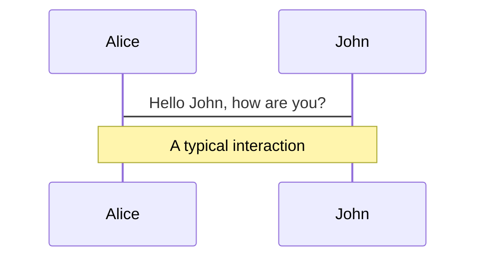
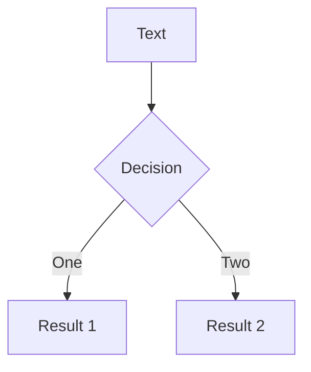

---
relates:
  - Mermaid: https://mermaid.js.org/
  - Mermaid Live Editor: https://mermaid.live/
  - Demo Slide: https://sli.dev/demo/starter/12
  - features/plantuml
tags: [diagram]
description: |
  Créer des diagrammes/graphiques à partir de descriptions textuelles, propulsé par Mermaid.
---

# Diagrammes Mermaid

Vous pouvez également créer des diagrammes/graphiques à partir de descriptions textuelles dans votre Markdown, propulsés par [Mermaid](https://mermaid.js.org/).

Les blocs de code marqués comme `mermaid` seront convertis en diagrammes, par exemple :

````md

````

Vous pouvez également passer un objet d'options pour spécifier la mise à l'échelle et le thème. La syntaxe de l'objet est un littéral objet JavaScript, vous devrez ajouter des guillemets (`'`) pour les chaînes et utiliser une virgule (`,`) entre les clés.

````md

````

Visitez le [site web de Mermaid](https://mermaid.js.org/) pour plus d'informations.
