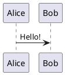

---
relates:
  - Plant UML: https://plantuml.com/
  - Plant UML Live Editor: https://plantuml.com/plantuml
  - Example Slide: https://sli.dev/demo/starter/12
  - features/mermaid
tags: [diagram]
description: |
  Créer des diagrammes à partir de descriptions textuelles, propulsé par PlantUML.
---

# Diagrammes PlantUML

Vous pouvez créer des diagrammes PlantUML facilement dans vos diapositives, par exemple :

````md

````

Le code source sera envoyé à https://www.plantuml.com/plantuml pour rendre le diagramme par défaut. Vous pouvez également configurer votre propre serveur en définissant `plantUmlServer` dans la [configuration de Slidev](../custom/index#headmatter).

Visitez le [site web de PlantUML](https://plantuml.com/) pour plus d'informations.
