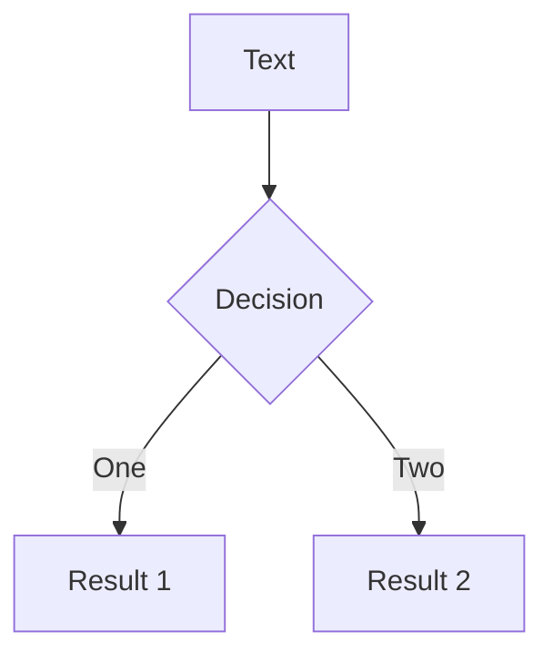

<<<<<<< HEAD
# Syntaxe de Markdown

Les diapositives sont écrites dans **un seul fichier markdown** (par défaut `./slides.md`).

Vous pouvez utiliser [les fonctionnalités Markdown](https://github.com/adam-p/markdown-here/wiki/Markdown-Cheatsheet) comme vous le feriez normalement, avec le support supplémentaire du HTML intégré et des composants Vue. Le style à l'aide de [Windi CSS](https://windicss.org) est également pris en charge. Utilisez `---` avec une nouvelle ligne pour séparer vos diapositives.
=======
---
outline: deep
---

# Markdown Syntax

Slides are written within **a single markdown file** (by default `./slides.md`).

You can use [the Markdown features](https://github.com/adam-p/markdown-here/wiki/Markdown-Cheatsheet) as you normally would, with the additional support of inlined HTML and Vue Components. Styling using [UnoCSS](/custom/config-unocss) is also supported. Use `---` padded with a new line to separate your slides.
>>>>>>> 21fdadc17cd2018f65c637e5727de640db5036e3

````md
# Slidev

Hello, World!

---

# Page 2

Utilisez directement des blocs de code pour la mise en évidence

```ts
console.log('Hello, World!')
```

---

# Page 3

Vous pouvez directement utiliser les composants Windi CSS et Vue pour styliser et enrichir vos diapositives.

<div class="p-3">
  <Tweet id="20" />
</div>
````

## Frontmatter & Layouts

<<<<<<< HEAD
Vous pouvez spécifier des mises en page et d'autres métadonnées pour chaque diapositive en convertissant les séparateurs en [blocs de présentation](https://jekyllrb.com/docs/front-matter/). Chaque avant-propos commence par un triple tiret et se termine par un autre. Les textes entre eux sont des objets de données au format [YAML](https://www.cloudbees.com/blog/yaml-tutorial-everything-you-need-get-started/). Par exemple :
=======
Specify layouts and other metadata for each slide by converting the separators into [frontmatter blocks](https://jekyllrb.com/docs/front-matter/). Each frontmatter starts with a triple-dash and ends with another. Texts between them are data objects in [YAML](https://www.cloudbees.com/blog/yaml-tutorial-everything-you-need-get-started/) format. For example:
>>>>>>> 21fdadc17cd2018f65c637e5727de640db5036e3

<!-- eslint-skip -->

```md
---
layout: cover
---

# Slidev

Ceci est la page de garde.

---
layout: center
background: /background-1.png
class: 'text-white'
---

# Page 2

Ceci est une page avec la mise en page «centre» et une image d'arrière-plan.

---

# Page 3

<<<<<<< HEAD
Il s'agit d'une page par défaut sans métadonnées supplémentaires.
~~~
=======
This is a default page without any additional metadata.
```
>>>>>>> 21fdadc17cd2018f65c637e5727de640db5036e3

Reportez-vous à [personnalisations](/custom/) pour plus de détails.

<<<<<<< HEAD
## Blocs de code

L'une des principales raisons pour lesquelles je construis Slidev est de faire en sorte que mon code apparaisse parfaitement dans les diapositives. Donc, comme vous vous y attendiez, vous pouvez utiliser le bloc de code aromatisé Markdown pour mettre en évidence votre code.
=======
### Prettier Support

> Available since v0.44

The custom syntax might not be compactible with some formatters like Prettier.
You can either install the [Prettier Plugin](/guide/editors#prettier-plugin) or use a direct `yaml` code block to define the frontmatter instead:

````md
---
layout: cover
---

# Slidev

This is the cover page.

---

```yaml
# The first yaml block will be treated as the frontmatter of that slide
layout: center
background: /background-1.png
class: 'text-white'
```

# Page 2

This is a page with the layout `center` and a background image.
````

## Code Blocks

One big reason that led to the creation of Slidev was the need to perfectly display code in slides. Consequently, you can use Markdown-flavored code blocks to highlight your code.
>>>>>>> 21fdadc17cd2018f65c637e5727de640db5036e3

````md
```ts
console.log('Hello, World!')
```
````

<<<<<<< HEAD
Nous supportons [Prism](http://prismjs.com) et [Shiki](https://github.com/shiki/shiki) en tant que surligneurs de syntaxe. Se référer à [la section Surligneurs](/custom/highlighters) pour plus de détails.
=======
Slidev has [Shiki](https://github.com/shikijs/shiki) built in as the syntax highlighter. Refer to [the highlighters section](/custom/highlighters) for more details.
>>>>>>> 21fdadc17cd2018f65c637e5727de640db5036e3

### Mise en évidence de ligne

<<<<<<< HEAD
Pour mettre en évidence des lignes spécifiques, ajoutez simplement des numéros de ligne entre crochets `{}`. Les numéros de ligne commencent à compter de 1.
=======
To highlight specific lines, simply add line numbers within brackets `{}`. Line numbers start counting from 1 by default.
>>>>>>> 21fdadc17cd2018f65c637e5727de640db5036e3

````md
```ts {2,3}
function add(
  a: Ref<number> | number,
  b: Ref<number> | number
) {
  return computed(() => unref(a) + unref(b))
}
```
````

<<<<<<< HEAD
Pour changer la surbrillance en plusieurs étapes, vous pouvez utiliser `|` pour les séparer. Par exemple
=======
To change what's highlighted with multiple clicks, you can use `|` to separate each stage:
>>>>>>> 21fdadc17cd2018f65c637e5727de640db5036e3

````md
```ts {2-3|5|all}
function add(
  a: Ref<number> | number,
  b: Ref<number> | number
) {
  return computed(() => unref(a) + unref(b))
}
```
````

<<<<<<< HEAD
Cela mettra d'abord en évidence `a: Ref <number> | number` et `b: Ref <number> | number`, puis `return computed (() => unref (a) + unref (b))` après un clic, et enfin, tout le bloc. Pour en savoir plus, consultez le [guide des animations de clics](/guide/animations).

Pour ignorer la mise en surbrillance des lignes, vous pouvez définir le numéro de ligne sur "0". Par exemple
=======
This will first highlight `a: Ref<number> | number` and `b: Ref<number> | number`, and then `return computed(() => unref(a) + unref(b))` after one click, and lastly, the whole block.

You can set the line number to `hide` to hide the code block or `none` to not highlight any line:
>>>>>>> 21fdadc17cd2018f65c637e5727de640db5036e3

````md
```ts {hide|none}
function add(
  a: Ref<number> | number,
  b: Ref<number> | number
) {
  return computed(() => unref(a) + unref(b))
}
```
````

<<<<<<< HEAD
Si le code ne rentre pas dans une diapositive, vous pouvez passer une option maxHeight supplémentaire qui définira une hauteur fixe
et activer le défilement
=======
::: tip
Learn more in the [click animations guide](./animations#positioning).
:::
>>>>>>> 21fdadc17cd2018f65c637e5727de640db5036e3

### Line Numbers

You can enable line numbering for all slides by setting `lineNumbers: true` in the global config or enable each code block individually by setting `lines: true`. You can also set the starting line for each code block and highlight the lines accordingly; it defaults to 1:

````md
```ts {6,7}{lines:true,startLine:5}
function add(
  a: Ref<number> | number,
  b: Ref<number> | number
) {
  return computed(() => unref(a) + unref(b))
}
```
````

### Max Height

If the code doesn't fit into one slide, you use the `maxHeight` to set fixed height and enable scrolling:

````md
```ts {2|3|7|12}{maxHeight:'100px'}
function add(
  a: Ref<number> | number,
  b: Ref<number> | number
) {
  return computed(() => unref(a) + unref(b))
}
/// ...as many lines as you want
const c = add(1, 2)
```
````

### TwoSlash Integration

> Available since v0.46

This feature is only available when you [set `highlighter` to `shiki`](/custom/highlighters)

[TwoSlash](https://twoslash.netlify.app/) is a powerful tool for rendering TypeScript code blocks with type information on hover or inlined. It's quite useful for preparing slides for JavaScript/TypeScript-related topics.

To use it, you can add `twoslash` to the code block's language identifier:

````md
```ts twoslash
import { ref } from 'vue'

const count = ref(0)
//            ^?
```
````

It will be rendered as:

```ts twoslash
import { ref } from 'vue'

const count = ref(0)
//            ^?
```

<!-- For the popup to not to overlap the content below -->
<div class="py-20" />

### Shiki Magic Move

> Available since v0.48

[Shiki Magic Move](https://github.com/shikijs/shiki-magic-move) enables you to have granular transition between code changes, similar to Keynote's Magic Move. You can check [the playground](https://shiki-magic-move.netlify.app/) to see how it works.

<video src="https://github.com/slidevjs/slidev/assets/11247099/79927794-27ba-4342-9911-9996cec889d6" controls rounded shadow w-full></video>

In Slidev, we bind the magic-move to the [clicks system](/guide/animations#click-animations). The syntax is to wrap multiple code blocks representing each step with <code>````md magic-move</code> (mind it's **4** backticks), this will be transformed into one code block, that morphs to each step as you click.

`````md
````md magic-move
```js
console.log(`Step ${1}`)
```
```js
console.log(`Step ${1 + 1}`)
```
```ts
console.log(`Step ${3}` as string)
```
````
`````

It's also possible to mix Magic Move with [line highlighting](#line-highlighting) and [line numbers](#line-numbers), for example:

`````md
````md magic-move {at:4, lines: true} // [!code hl]
```js {*|1|2-5} // [!code hl]
let count = 1
function add() {
  count++
}
```

Non-code blocks in between as ignored, you can put some comments.

```js {*}{lines: false} // [!code hl]
let count = 1
const add = () => count += 1
```
````
`````

<!-- TODO: add an inline demo -->

### Éditeur Monaco

Chaque fois que vous souhaitez apporter des modifications à la présentation, ajoutez simplement `{monaco}` après l'identifiant de la langue - cela transforme le bloc en un éditeur Monaco complet!

````md
```ts {monaco}
console.log('HelloWorld')
```
````

En savoir plus sur la [configuration de Monaco](/custom/config-monaco).

<<<<<<< HEAD
## Styles intégrés
=======
#### Monaco Diff

Monaco can also generate a diff between two code blocks. Use `{monaco-diff}` to turn the block into a [diff Monaco editor](https://microsoft.github.io/monaco-editor/playground.html?source=v0.36.1#example-creating-the-diffeditor-multi-line-example) and use `~~~` to separate both original and modified version of the code!

````md
```ts {monaco-diff}
This line is removed on the right.
just some text
abcd
efgh
Some more text
~~~
just some text
abcz
zzzzefgh
Some more text.
This line is removed on the left.
```
````

It provides the editor with a "Run" button, and shows the result of the code execution right below the code block. You may also modify the code and the result will be re-evaluated on the fly.

By default it will automatically run the code when the slide is loaded; if you want to instead explicitly trigger the run, you can set `{autorun:false}`.

````md
```ts {monaco-run} {autorun:false}
console.log('Click the play button to run me')
```
````

If you want to only show the output in certain clicks, you can use the `showOutputAt` prop. The value is the same as `v-click`.

````md
```ts {monaco-run} {showOutputAt:'+1'}
console.log('Shown after 1 click')
```
````

Currently Slidev supports running JavaScript and TypeScript code out-of-box. Refer to [Custom Code Runners](/custom/config-code-runners) for custom languages support.

#### Writable Monaco Editor

> Available since v0.49.5

You can also use the [Import Code Snippets](#import-code-snippets) syntax combining with the `{monaco-write}` directive, to link your Monaco Editor with a file on your filesystem. This will allow you to edit the code directly in the editor and save the changes back to the file.

```md
<<< ./some-file.ts {monaco-write}
```

When using this, be sure to back up your files beforehand, as the changes will be saved directly to the file.

## Embedded Styles
>>>>>>> 21fdadc17cd2018f65c637e5727de640db5036e3

Vous pouvez utiliser la balise `<style>` dans votre Markdown directement pour remplacer les styles de la **diapositive actuelle**.

```md
# C'est rouge

<style>
h1 {
  color: red
}
</style>

---

# La prochaine diapositive n'est pas affectée
```

<<<<<<< HEAD
La balise `<style>` dans Markdown est toujours [scoped](https://vue-loader.vuejs.org/guide/scoped-css.html). Pour avoir des remplacements de style globaux, consultez la [section de personnalisation](/custom/directory-structure#style).

Propulsé par [Windi CSS](https://windicss.org), vous pouvez utiliser directement des css imbriqués et des [répertoires](https://windicss.org/features/directives.html) (par exemple, `@apply`)
=======
The `<style>` tag in Markdown is always [scoped](https://vuejs.org/api/sfc-css-features.html#scoped-css). As a result, a selector with a child combinator (`.a > .b`) is unusable as such; see the previous link. To have global style overrides, check out the [customization section](/custom/directory-structure#style).

Powered by [UnoCSS](/custom/config-unocss), you can directly use nested css and [directives](https://unocss.dev/transformers/directives) (e.g. `--uno:` or `@apply`)
>>>>>>> 21fdadc17cd2018f65c637e5727de640db5036e3

```md
# Slidev

> Hello `world`

<style>
blockquote {
  code {
    --uno: text-teal-500 dark:text-teal-400;
  }
}
</style>
```

## Assets statiques

Tout comme vous le feriez dans Markdown, vous pouvez utiliser des images pointant vers une URL distante ou locale.

<<<<<<< HEAD
Pour les assets statiques, le [`vite-plugin-remote-assets`](https://github.com/antfu/vite-plugin-remote-assets) intégré les mettra en cache sur le disque à la première exécution afin que vous puissiez avoir un chargement instantané même pour de grandes images plus tard.
=======
For remote assets, the built-in [`vite-plugin-remote-assets`](https://github.com/antfu/vite-plugin-remote-assets) will cache them onto the disk at first run, ensuring instant loading even for large images later on.
>>>>>>> 21fdadc17cd2018f65c637e5727de640db5036e3

```md

```

Pour les ressources locales, placez-les dans le [dossier `public`](/custom/directory-structure.html#public) et référencez-les avec **la barre oblique principale**.

```md

```

<<<<<<< HEAD
Si vous souhaitez appliquer des tailles ou des styles personnalisés, vous pouvez les convertir en balise ``
=======
For you want to apply custom sizes or styles, you can convert them to the `` tag
>>>>>>> 21fdadc17cd2018f65c637e5727de640db5036e3

```html

```

## Remarques

<<<<<<< HEAD
Vous pouvez également prendre des notes pour chaque diapositive. Ils apparaîtront en [Mode Présentateur](/guide/presenter-mode) pour que vous puissiez vous y référer pendant les présentations.
=======
You can also create presenter notes for each slide. They will show up in [Presenter Mode](/guide/presenter-mode) for you to reference during presentations.
>>>>>>> 21fdadc17cd2018f65c637e5727de640db5036e3

Dans Markdown, le dernier bloc de commentaire de chaque diapositive sera traité comme une note.

```md
---
layout: cover
---

# Page 1

Ceci est la page de garde.

<!-- Ceci est une note -->

---

# Page 2

<!-- Ce n'est PAS une note car elle précède le contenu de la diapositive -->

La deuxième page

<!--
Ceci est une autre note
-->
```

Basic Markdown and HTML are also supported in notes when the Presenter renders note content.

### Click Markers

> Available since v0.48

For some slides you might have longer notes that could be hard to find your place. Slidev supports click markers that allow highlighting and auto-scrolling to the section of notes from your corresponding content. Put `[click]` markers at the beginning of any line in your notes for the timing you need to go to another [click](/guide/animations#click-animations). You may skip `n` clicks by using `[click:{n+1}]`. For example:

```md
<!--
Content before the first click

[click] This will be highlighted after the first click

Also highlighted after the first click

- [click] This list element will be highlighted after the second click

[click:3] Last click (skip two clicks)
-->
```

Slidev divides the content between the click markers and highlights it in presenter notes, synchronized with your slide progress.

<!-- TODO: add a video -->

## Icônes

<<<<<<< HEAD
Slidev vous permet d'accéder à presque tous les jeux d'icônes open-source populaires **directement** dans votre markdown. Propulsé par [`unplugin-icons`](https://github.com/antfu/unplugin-icons) et [Iconify](https://iconify.design/).

Le nom suit la conversion de [Iconify](https://iconify.design/) `{collection-name}-{icon-name}`. Par exemple:

- `<mdi-account-circle />` - <mdi-account-circle /> de [Material Design Icons](https://github.com/Templarian/MaterialDesign)
- `<carbon-badge />` - <carbon-badge /> de [Carbon](https://github.com/carbon-design-system/carbon/tree/main/packages/icons)
- `<uim-rocket />` - <uim-rocket /> de [Unicons Monochrome](https://github.com/Iconscout/unicons)
- `<twemoji-chat-avec-des-larmes-de-joie />` - <twemoji-cat-with-tears-of-joy /> de [Twemoji](https://github.com/twitter/twemoji)
- `<logos-vue />` - <logos-vue /> de [Logos SVG](https://github.com/gilbarbara/logos)
- Et beaucoup plus...
=======
Slidev allows you to have access to virtually all open-source icon sets **directly** in your markdown after installing the corresponding package. Powered by [`unplugin-icons`](https://github.com/antfu/unplugin-icons) and [Iconify](https://iconify.design/).

The naming follows [Iconify](https://iconify.design/)'s convention of `{collection-name}-{icon-name}`. For example:

- `<mdi-account-circle />` - <mdi-account-circle /> from [Material Design Icons](https://github.com/Templarian/MaterialDesign) - [`@iconify-json/mdi`](https://npmjs.com/package/@iconify-json/mdi)
- `<carbon-badge />` - <carbon-badge /> from [Carbon](https://github.com/carbon-design-system/carbon/tree/main/packages/icons) - [`@iconify-json/carbon`](https://npmjs.com/package/@iconify-json/carbon)
- `<uim-rocket />` - <uim-rocket /> from [Unicons Monochrome](https://github.com/Iconscout/unicons) - [`@iconify-json/uim`](https://npmjs.com/package/@iconify-json/uim)
- `<twemoji-cat-with-tears-of-joy />` - <twemoji-cat-with-tears-of-joy /> from [Twemoji](https://github.com/twitter/twemoji) - [`@iconify-json/twemoji`](https://npmjs.com/package/@iconify-json/twemoji)
- `<logos-vue />` - <logos-vue /> from [SVG Logos](https://github.com/gilbarbara/logos) - [`@iconify-json/logos`](https://npmjs.com/package/@iconify-json/logos)
- And much more...
>>>>>>> 21fdadc17cd2018f65c637e5727de640db5036e3

Vous pouvez parcourir et rechercher toutes les icônes disponibles avec [Icônes](https://icones.js.org/).

### Icônes de style

Vous pouvez styliser les icônes comme les autres éléments HTML. Par exemple :

```html
<uim-rocket />
<uim-rocket class="text-3xl text-red-400 mx-2" />
<uim-rocket class="text-3xl text-orange-400 animate-ping" />
```

<uim-rocket />
<uim-rocket class="text-3xl text-red-400 mx-2" />
<uim-rocket class="text-3xl text-orange-400 animate-ping ml-2" />

## Emplacements

> Disponible depuis v0.18

Certaines mises en page peuvent fournir de multiples points de contributions utilisant [Les emplacements nommés de Vue](https://v3.vuejs.org/guide/component-slots.html).

Par exemple, dans [la mise en page `two-cols`](https://github.com/slidevjs/slidev/blob/main/packages/client/layouts/two-cols.vue), vous pouvez avoir deux colonnes à gauche (emplacement `par défaut`) et à droite (emplacement de `droite`) côte à côte.

```md
---
layout: two-cols
---

<template v-slot:default>

# Gauche

Cela apparaît sur la gauche

</template>
<template v-slot:right>

# Droite

Cela apparaît sur la droite

</template>
```

<div class="grid grid-cols-2 rounded border border-gray-400 border-opacity-50 px-10 pb-4">
<div>

<h3>Gauche</h3>
<p>Cela apparaît sur la gauche</p>
</div>
<div>
<h3>Droite</h3>
<p>Cela apparaît sur la droite</p>
</div>
</div>

<<<<<<< HEAD
Nous fournissons également une syntaxe abrégée `::name::` pour le nom de l'emplacement. L'exemple suivant fonctionne exactement de la même manière que le précédent.
=======
We also provide a shorthand syntactical sugar `::name::` for slot name. The following works exactly the same as the previous example.
>>>>>>> 21fdadc17cd2018f65c637e5727de640db5036e3

```md
---
layout: two-cols
---

# Gauche

Cela apparaît sur la gauche

::right::

# Droite

Cela apparaît sur la droite
```

<<<<<<< HEAD
Vous pouvez également spécifier explicitement l'emplacement par défaut et fournir dans un ordre personnalisé
=======
You can also explicitly specify the default slot and provide in the custom order.
>>>>>>> 21fdadc17cd2018f65c637e5727de640db5036e3

```md
---
layout: two-cols
---

::right::

# Droite

Cela apparaît sur la droite

::default::

# Gauche

Cela apparaît sur la gauche
```

## Import Code Snippets

> Available since v0.47.0

You can import code snippets from existing files via following syntax:

```md
<<< @/snippets/snippet.js
```

::: tip
The value of `@` corresponds to the source root, the directory where the `slides.md` is located.
:::

This feature is vendored from VitePress, learn more about it in [VitePress's documentation](https://vitepress.dev/guide/markdown#import-code-snippets).

## Configurations

<<<<<<< HEAD
Toutes les configurations nécessaires peuvent être définies dans le fichier Markdown. Par exemple :
=======
All configurations can be defined in the Markdown file. For example:
>>>>>>> 21fdadc17cd2018f65c637e5727de640db5036e3

```md
---
theme: seriph
layout: cover
background: 'https://source.unsplash.com/1600x900/?nature,water'
---

# Slidev

Ceci est la page de garde.
```

En savoir plus sur les [configurations frontmatter](/custom/#frontmatter-configures).

## LaTeX

Slidev est livré avec le support LaTeX prêt à l'emploi, alimenté par [KaTeX](https://katex.org/).

<TheTweet id="1392246507793915904" />

### Rendu en ligne

Entourez votre LaTeX d'un seul `$` de chaque côté pour un rendu en ligne.

```md
$\sqrt{3x-1}+(1+x)^2$
```

### Block

Utilisez deux (`$$`) pour le rendu en bloc. Ce mode utilise des symboles plus grands et centre
le résultat.

```latex
$$
\begin{array}{c}

\nabla \times \vec{\mathbf{B}} -\, \frac1c\, \frac{\partial\vec{\mathbf{E}}}{\partial t} &
= \frac{4\pi}{c}\vec{\mathbf{j}}    \nabla \cdot \vec{\mathbf{E}} & = 4 \pi \rho \\

\nabla \times \vec{\mathbf{E}}\, +\, \frac1c\, \frac{\partial\vec{\mathbf{B}}}{\partial t} & = \vec{\mathbf{0}} \\

\nabla \cdot \vec{\mathbf{B}} & = 0

\end{array}
$$
```

En savoir plus: [Démo](https://sli.dev/demo/starter/8) | [KaTeX](https://katex.org/) | [`markdown-it-katex`](https://github.com/waylonflinn/markdown-it-katex)

<<<<<<< HEAD
## Diagrammes
=======
### LaTex line highlighting

> Available since v0.43.1

To highlight specific lines, simply add line numbers within bracket `{}`. Line numbers start counting from 1 by default.

```latex
$$ {1|3|all}
\begin{array}{c}
\nabla \times \vec{\mathbf{B}} -\, \frac1c\, \frac{\partial\vec{\mathbf{E}}}{\partial t} &
= \frac{4\pi}{c}\vec{\mathbf{j}}    \nabla \cdot \vec{\mathbf{E}} & = 4 \pi \rho \\
\nabla \times \vec{\mathbf{E}}\, +\, \frac1c\, \frac{\partial\vec{\mathbf{B}}}{\partial t} & = \vec{\mathbf{0}} \\
\nabla \cdot \vec{\mathbf{B}} & = 0
\end{array}
$$
```

The `at` and `finally` options of [code blocks](#line-highlighting) are also available for LaTeX blocks.

## Diagrams
>>>>>>> 21fdadc17cd2018f65c637e5727de640db5036e3

Vous pouvez également créer des diagrammes / graphiques à partir de descriptions textuelles dans votre Markdown, alimenté par [Mermaid](https://mermaid-js.github.io/mermaid).

Les blocs de code marqués comme `mermaid` seront convertis en digrammes, par exemple :

````md
```mermaid
sequenceDiagram
<<<<<<< HEAD
Alice->John: Hello John, how are you?
Note over Alice,John: A typical interaction
//```
~~~
=======
  Alice->John: Hello John, how are you?
  Note over Alice,John: A typical interaction
```
````
>>>>>>> 21fdadc17cd2018f65c637e5727de640db5036e3

Vous pouvez en outre lui transmettre un objet d'options pour spécifier la mise à l'échelle et la thématisation. La syntaxe de l'objet est un littéral d'objet JavaScript, vous devrez ajouter des guillemets (`` '') pour les chaînes et utiliser une virgule (`,`) entre les clés.

````md

````

En savoir plus: [Démo](https://sli.dev/demo/starter/9) | [Mermaid](https://mermaid-js.github.io/mermaid)

## Entrées multiples

Depuis la version v0.15.0, nous avons livré le support multi-entrées. Cela signifie que vous pouvez diviser votre `slides.md` en plusieurs fichiers and les organiser comme vous le souhaitez.

<<<<<<< HEAD
> Disponible depuis v0.15

Vous pouvez diviser votre `slides.md` en plusieurs fichiers et les organiser comme vous le souhaitez.
=======
You can split your `slides.md` into multiple files and organize them however you'd like.
>>>>>>> 21fdadc17cd2018f65c637e5727de640db5036e3

`slides.md` :

<!-- eslint-skip -->

```md
# Page 1

Ceci est une page normale

---
src: ./sous-page2.md
---

<!-- Cette page sera chargée depuis './subpage2.md' -->
Le contenu en ligne sera ignoré
```

`sous-page2.md` :

```md
# Page 2

Cette page provient d'un autre fichier
```

### Fusion de frontmatter

<<<<<<< HEAD
Vous pouvez fournir des frontmatters depuis l'entrée principale mais également depuis une page markdown externe. S'il y a les mêmes clés, celles de l'**entrée principale ont la priorité la plus élevée**. Par exemple
=======
You can provide frontmatter instructions from both your main entry and external markdown pages. If there are duplicate keys in them, the ones from the **main entry have the higher priority**. For example:
>>>>>>> 21fdadc17cd2018f65c637e5727de640db5036e3

`slides.md` :

```md
---
src: ./cover.md
background: https://sli.dev/bar.png
class: text-center
---
```

`cover.md` :

```md
---
layout: cover
background: https://sli.dev/foo.png
---

# Couverture

Page de couverture
```

Ils finiront par être équivalents à la page suivante :

```md
---
layout: cover
background: https://sli.dev/bar.png
class: text-center
---

# Couverture

Page de couverture
```

<<<<<<< HEAD
### Réutilisation de la page
=======
### Page Reuse
>>>>>>> 21fdadc17cd2018f65c637e5727de640db5036e3

Avec la prise en charge des entrées multiples, la réutilisation des pages peut être simple. Par exemple :

```yaml
---
src: ./cover.md
---

---
src: ./intro.md
---

---
src: ./content.md
---

---
# réutilisation
src: ./content.md
---
```

## MDC Syntax

> Available since v0.43.0

Slidev supports optional [MDC (Markdown Components) Syntax](https://content.nuxtjs.org/guide/writing/mdc) powered by [`markdown-it-mdc`](https://github.com/antfu/markdown-it-mdc).

You can enable it by adding `mdc: true` to the frontmatter of your markdown file.

```mdc
---
mdc: true
---

This is a [red text]{style="color:red"} :inline-component{prop="value"}

{width=500px lazy}

::block-component{prop="value"}
The **default** slot
::
```

Learn more about [MDC Syntax](https://content.nuxt.com/guide/writing/mdc).
