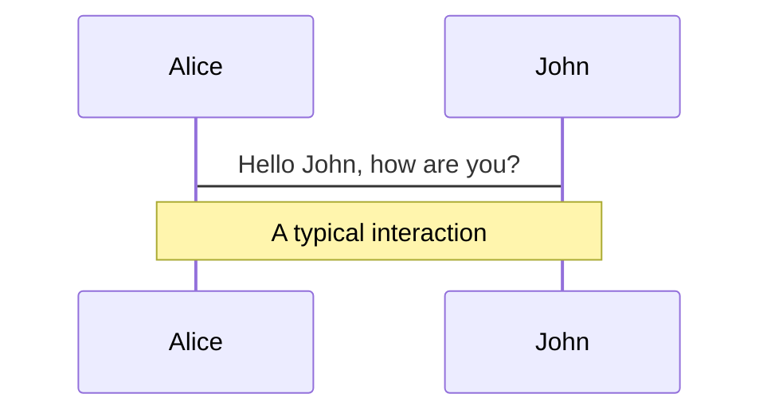
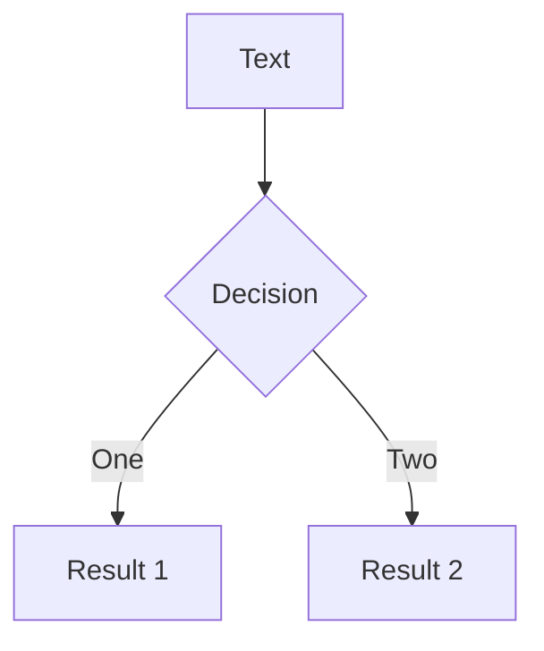

# Syntaxe de Markdown

Les diapositives sont écrites dans **un seul fichier markdown** (par défaut `./slides.md`).

Vous pouvez utiliser [les fonctionnalités Markdown](https://github.com/adam-p/markdown-here/wiki/Markdown-Cheatsheet) comme vous le feriez normalement, avec le support supplémentaire du HTML intégré et des composants Vue. Le style à l'aide de [UnoCSS](/custom/config-unocss) est également pris en charge. Utilisez `---` avec une nouvelle ligne pour séparer vos diapositives.

````md
# Slidev

Hello, World!

---

# Page 2

Utilisez directement des blocs de code pour la mise en évidence

```ts
console.log('Hello, World!')
```

---

# Page 3

Vous pouvez directement utiliser les composants UnoCSS et Vue pour styliser et enrichir vos diapositives.

<div class="p-3">
  <Tweet id="20" />
</div>
````

## Frontmatter & Layouts

Vous pouvez spécifier des mises en page et d'autres métadonnées pour chaque diapositive en convertissant les séparateurs en [blocs de présentation](https://jekyllrb.com/docs/front-matter/). Chaque avant-propos commence par un triple tiret et se termine par un autre. Les textes entre eux sont des objets de données au format [YAML](https://www.cloudbees.com/blog/yaml-tutorial-everything-you-need-get-started/). Par exemple :

<!-- eslint-skip -->

```md
---
layout: cover
---

# Slidev

Ceci est la page de garde.

---
layout: center
background: /background-1.png
class: 'text-white'
---

# Page 2

Ceci est une page avec la mise en page «centre» et une image d'arrière-plan.

---

# Page 3

Il s'agit d'une page par défaut sans métadonnées supplémentaires.
```

Reportez-vous à [personnalisations](/custom/) pour plus de détails.

### Prettier Support

> Disponible depuis v0.44

La syntaxe personnalisée pourrait ne pas être compatible avec certains formateurs comme Prettier.
Vous pouvez soit installer le [Plugin Prettier](/guide/editors#prettier-plugin), soit utiliser un bloc de code `yaml` direct pour définir le frontmatter à la place :

````md
---
layout: cover
---

# Slidev

Ceci est la page de garde.

---

```yaml
# Le premier bloc yaml sera traité comme le frontmatter de cette diapositive
layout: center
background: /background-1.png
class: 'text-white'
```

# Page 2

Ceci est une page avec la mise en page `center` et une image d'arrière-plan.
````

## Blocs de code

L'une des principales raisons pour lesquelles je construis Slidev est de faire en sorte que mon code apparaisse parfaitement dans les diapositives. Donc, comme vous vous y attendiez, vous pouvez utiliser le bloc de code aromatisé Markdown pour mettre en évidence votre code.

````md
```ts
console.log('Hello, World!')
```
````

Slidev a [Shiki](https://github.com/shikijs/shiki) intégré en tant que surligneur de syntaxe. Se référer à [la section Surligneurs](/custom/highlighters) pour plus de détails.

### Mise en évidence de ligne

Pour mettre en évidence des lignes spécifiques, ajoutez simplement des numéros de ligne entre crochets `{}`. Les numéros de ligne commencent à compter de 1 par défaut.

````md
```ts {2,3}
function add(
  a: Ref<number> | number,
  b: Ref<number> | number
) {
  return computed(() => unref(a) + unref(b))
}
```
````

Pour changer la surbrillance en plusieurs étapes, vous pouvez utiliser `|` pour les séparer. Par exemple :

````md
```ts {2-3|5|all}
function add(
  a: Ref<number> | number,
  b: Ref<number> | number
) {
  return computed(() => unref(a) + unref(b))
}
```
````

Cela mettra d'abord en évidence `a: Ref<number> | number` et `b: Ref<number> | number`, puis `return computed(() => unref(a) + unref(b))` après un clic, et enfin, tout le bloc.

Vous pouvez définir le numéro de ligne sur `hide` pour masquer le bloc de code ou `none` pour ne surligner aucune ligne :

````md
```ts {hide|none}
function add(
  a: Ref<number> | number,
  b: Ref<number> | number
) {
  return computed(() => unref(a) + unref(b))
}
```
````

::: tip
Apprenez-en plus dans le [guide des animations de clic](./animations#positioning).
:::

### Numéros de ligne

Vous pouvez activer la numérotation des lignes pour toutes les diapositives en définissant `lineNumbers: true` dans la configuration globale, ou activer chaque bloc de code individuellement en définissant `lines: true`. Vous pouvez également définir la ligne de départ pour chaque bloc de code et surligner les lignes en conséquence ; la valeur par défaut est 1 :

````md
```ts {6,7}{lines:true,startLine:5}
function add(
  a: Ref<number> | number,
  b: Ref<number> | number
) {
  return computed(() => unref(a) + unref(b))
}
```
````

### Hauteur maximale

Si le code ne rentre pas dans une diapositive, vous pouvez utiliser `maxHeight` pour définir une hauteur fixe et activer le défilement :

````md
```ts {2|3|7|12}{maxHeight:'100px'}
function add(
  a: Ref<number> | number,
  b: Ref<number> | number
) {
  return computed(() => unref(a) + unref(b))
}
/// ...autant de lignes que vous voulez
const c = add(1, 2)
```
````

### Intégration TwoSlash

> Disponible depuis v0.46

Cette fonctionnalité n'est disponible que lorsque vous [définissez `highlighter` sur `shiki`](/custom/highlighters)

[TwoSlash](https://twoslash.netlify.app/) est un outil puissant pour rendre les blocs de code TypeScript avec des informations de type au survol ou intégrées. C'est très utile pour préparer des diapositives sur des sujets liés à JavaScript/TypeScript.

Pour l'utiliser, vous pouvez ajouter `twoslash` à l'identifiant de langue du bloc de code :

````md
```ts twoslash
import { ref } from 'vue'

const count = ref(0)
//            ^?
```
````

Il sera rendu comme :

```ts twoslash
import { ref } from 'vue'

const count = ref(0)
//            ^?
```

<!-- For the popup to not to overlap the content below -->
<div class="py-20" />

### Shiki Magic Move

> Disponible depuis v0.48

[Shiki Magic Move](https://github.com/shikijs/shiki-magic-move) vous permet d'avoir des transitions granulaires entre les changements de code, similaires au Magic Move de Keynote. Vous pouvez consulter [le playground](https://shiki-magic-move.netlify.app/) pour voir comment cela fonctionne.

<video src="https://github.com/slidevjs/slidev/assets/11247099/79927794-27ba-4342-9911-9996cec889d6" controls rounded shadow w-full></video>

Dans Slidev, nous lions le magic-move au [système de clics](/guide/animations#click-animations). La syntaxe consiste à envelopper plusieurs blocs de code représentant chaque étape avec <code>````md magic-move</code> (attention, il y a **4** backticks), cela sera transformé en un seul bloc de code, qui se métamorphose à chaque étape au fur et à mesure que vous cliquez.

`````md
````md magic-move
```js
console.log(`Step ${1}`)
```
```js
console.log(`Step ${1 + 1}`)
```
```ts
console.log(`Step ${3}` as string)
```
````
`````

Il est également possible de mélanger Magic Move avec [la mise en évidence de ligne](#mise-en-evidence-de-ligne) et [les numéros de ligne](#numeros-de-ligne), par exemple :

`````md
````md magic-move {at:4, lines: true} // [!code hl]
```js {*|1|2} // [!code hl]
let count = 1
function add() {
  count++
}
```

Les blocs non-code entre les deux sont ignorés, vous pouvez y mettre des commentaires.

```js {*}{lines: false} // [!code hl]
let count = 1
const add = () => count += 1
```
````
`````

<!-- TODO: add an inline demo -->

### Éditeur Monaco

Chaque fois que vous souhaitez apporter des modifications à la présentation, ajoutez simplement `{monaco}` après l'identifiant de la langue - cela transforme le bloc en un éditeur Monaco complet !

````md
```ts {monaco}
console.log('HelloWorld')
```
````

En savoir plus sur la [configuration de Monaco](/custom/config-monaco).

#### Monaco Diff

Monaco peut également générer un diff entre deux blocs de code. Utilisez `{monaco-diff}` pour transformer le bloc en un [éditeur diff Monaco](https://microsoft.github.io/monaco-editor/playground.html?source=v0.36.1#example-creating-the-diffeditor-multi-line-example) et utilisez `~~~` pour séparer la version originale et modifiée du code !

````md
```ts {monaco-diff}
This line is removed on the right.
just some text
abcd
efgh
Some more text
~~~
just some text
abcz
zzzzefgh
Some more text.
This line is removed on the left.
```
````

#### Exécution Monaco

Il fournit à l'éditeur un bouton « Exécuter », et affiche le résultat de l'exécution du code juste en dessous du bloc de code. Vous pouvez également modifier le code et le résultat sera réévalué à la volée.

Par défaut, il exécutera automatiquement le code lorsque la diapositive est chargée ; si vous souhaitez plutôt déclencher explicitement l'exécution, vous pouvez définir `{autorun:false}`.

````md
```ts {monaco-run} {autorun:false}
console.log('Cliquez sur le bouton de lecture pour m\'exécuter')
```
````

Si vous souhaitez n'afficher le résultat qu'à certains clics, vous pouvez utiliser la prop `showOutputAt`. La valeur est la même que `v-click`.

````md
```ts {monaco-run} {showOutputAt:'+1'}
console.log('Affiché après 1 clic')
```
````

Actuellement, Slidev supporte l'exécution de JavaScript et TypeScript directement. Référez-vous à [Exécuteurs de Code Personnalisés](/custom/config-code-runners) pour le support des langages personnalisés.

#### Éditeur Monaco Writable

> Disponible depuis v0.49.5

Vous pouvez également utiliser la syntaxe [Importer des Extraits de Code](#importer-des-extraits-de-code) combinée avec la directive `{monaco-write}`, pour lier votre éditeur Monaco avec un fichier sur votre système de fichiers. Cela vous permettra de modifier le code directement dans l'éditeur et d'enregistrer les modifications dans le fichier.

```md
<<< ./some-file.ts {monaco-write}
```

Lorsque vous utilisez cela, assurez-vous de sauvegarder vos fichiers au préalable, car les modifications seront enregistrées directement dans le fichier.

## Styles intégrés

Vous pouvez utiliser la balise `<style>` dans votre Markdown directement pour remplacer les styles de la **diapositive actuelle**.

```md
# C'est rouge

<style>
h1 {
  color: red
}
</style>

---

# La prochaine diapositive n'est pas affectée
```

La balise `<style>` dans Markdown est toujours [scoped](https://vuejs.org/api/sfc-css-features.html#scoped-css). En conséquence, un sélecteur avec un combinateur enfant (`.a > .b`) n'est pas utilisable en tant que tel ; voir le lien précédent. Pour avoir des remplacements de style globaux, consultez la [section de personnalisation](/custom/directory-structure#style).

Propulsé par [UnoCSS](/custom/config-unocss), vous pouvez utiliser directement des css imbriqués et des [directives](https://unocss.dev/transformers/directives) (par exemple, `--uno:` ou `@apply`)

```md
# Slidev

> Hello `world`

<style>
blockquote {
  code {
    --uno: text-teal-500 dark:text-teal-400;
  }
}
</style>
```

## Assets statiques

Tout comme vous le feriez dans Markdown, vous pouvez utiliser des images pointant vers une URL distante ou locale.

Pour les assets distants, le [`vite-plugin-remote-assets`](https://github.com/antfu/vite-plugin-remote-assets) intégré les mettra en cache sur le disque à la première exécution afin que vous puissiez avoir un chargement instantané même pour de grandes images plus tard.

```md

```

Pour les ressources locales, placez-les dans le [dossier `public`](/custom/directory-structure.html#public) et référencez-les avec **la barre oblique principale**.

```md

```

Si vous souhaitez appliquer des tailles ou des styles personnalisés, vous pouvez les convertir en balise ``

```html

```

## Remarques

Vous pouvez également créer des notes de présentateur pour chaque diapositive. Elles apparaîtront en [Mode Présentateur](/guide/presenter-mode) pour que vous puissiez vous y référer pendant les présentations.

Dans Markdown, le dernier bloc de commentaire de chaque diapositive sera traité comme une note.

```md
---
layout: cover
---

# Page 1

Ceci est la page de garde.

<!-- Ceci est une note -->

---

# Page 2

<!-- Ce n'est PAS une note car elle précède le contenu de la diapositive -->

La deuxième page

<!--
Ceci est une autre note
-->
```

Le Markdown de base et le HTML sont également supportés dans les notes lorsque le Présentateur rend le contenu des notes.

### Marqueurs de Clic

> Disponible depuis v0.48

Pour certaines diapositives, vous pourriez avoir des notes plus longues qui pourraient être difficiles à suivre. Slidev supporte des marqueurs de clic qui permettent de surligner et de faire défiler automatiquement vers la section de notes correspondant à votre contenu. Placez les marqueurs `\[click\]` au début de n'importe quelle ligne dans vos notes pour le moment où vous devez passer à un autre [clic](/guide/animations#click-animations). Vous pouvez sauter `n` clics en utilisant `\[click:{n+1}\]`. Par exemple :

```md
<!--
Contenu avant le premier clic

[click] Cela sera surligné après le premier clic

Également surligné après le premier clic

- [click] Cet élément de liste sera surligné après le deuxième clic

[click:3] Dernier clic (sauter deux clics)
-->
```

Slidev divise le contenu entre les marqueurs de clic et le surligne dans les notes du présentateur, synchronisé avec la progression de votre diapositive.

<!-- TODO: add a video -->

## Icônes

Slidev vous permet d'accéder à presque tous les jeux d'icônes open-source populaires **directement** dans votre markdown après avoir installé le package correspondant. Propulsé par [`unplugin-icons`](https://github.com/antfu/unplugin-icons) et [Iconify](https://iconify.design/).

Le nom suit la convention de [Iconify](https://iconify.design/) `{collection-name}-{icon-name}`. Par exemple :

- `<mdi-account-circle />` - <mdi-account-circle /> de [Material Design Icons](https://github.com/Templarian/MaterialDesign) - [`@iconify-json/mdi`](https://npmjs.com/package/@iconify-json/mdi)
- `<carbon-badge />` - <carbon-badge /> de [Carbon](https://github.com/carbon-design-system/carbon/tree/main/packages/icons) - [`@iconify-json/carbon`](https://npmjs.com/package/@iconify-json/carbon)
- `<uim-rocket />` - <uim-rocket /> de [Unicons Monochrome](https://github.com/Iconscout/unicons) - [`@iconify-json/uim`](https://npmjs.com/package/@iconify-json/uim)
- `<twemoji-cat-with-tears-of-joy />` - <twemoji-cat-with-tears-of-joy /> de [Twemoji](https://github.com/twitter/twemoji) - [`@iconify-json/twemoji`](https://npmjs.com/package/@iconify-json/twemoji)
- `<logos-vue />` - <logos-vue /> de [SVG Logos](https://github.com/gilbarbara/logos) - [`@iconify-json/logos`](https://npmjs.com/package/@iconify-json/logos)
- Et beaucoup plus...

Vous pouvez parcourir et rechercher toutes les icônes disponibles avec [Icônes](https://icones.js.org/).

### Icônes de style

Vous pouvez styliser les icônes comme les autres éléments HTML. Par exemple :

```html
<uim-rocket />
<uim-rocket class="text-3xl text-red-400 mx-2" />
<uim-rocket class="text-3xl text-orange-400 animate-ping" />
```

<uim-rocket />
<uim-rocket class="text-3xl text-red-400 mx-2" />
<uim-rocket class="text-3xl text-orange-400 animate-ping ml-2" />

## Emplacements

> Disponible depuis v0.18

Certaines mises en page peuvent fournir de multiples points de contributions utilisant [Les emplacements nommés de Vue](https://v3.vuejs.org/guide/component-slots.html).

Par exemple, dans [la mise en page `two-cols`](https://github.com/slidevjs/slidev/blob/main/packages/client/layouts/two-cols.vue), vous pouvez avoir deux colonnes à gauche (emplacement `par défaut`) et à droite (emplacement de `droite`) côte à côte.

```md
---
layout: two-cols
---

<template v-slot:default>

# Gauche

Cela apparaît sur la gauche

</template>
<template v-slot:right>

# Droite

Cela apparaît sur la droite

</template>
```

<div class="grid grid-cols-2 rounded border border-gray-400 border-opacity-50 px-10 pb-4">
<div>

<h3>Gauche</h3>
<p>Cela apparaît sur la gauche</p>
</div>
<div>
<h3>Droite</h3>
<p>Cela apparaît sur la droite</p>
</div>
</div>

Nous fournissons également une syntaxe abrégée `::name::` pour le nom de l'emplacement. L'exemple suivant fonctionne exactement de la même manière que le précédent.

```md
---
layout: two-cols
---

# Gauche

Cela apparaît sur la gauche

::right::

# Droite

Cela apparaît sur la droite
```

Vous pouvez également spécifier explicitement l'emplacement par défaut et fournir dans un ordre personnalisé.

```md
---
layout: two-cols
---

::right::

# Droite

Cela apparaît sur la droite

::default::

# Gauche

Cela apparaît sur la gauche
```

## Importer des Extraits de Code

> Disponible depuis v0.47.0

Vous pouvez importer des extraits de code depuis des fichiers existants via la syntaxe suivante :

```md
<<< @/snippets/snippet.js
```

::: tip
La valeur de `@` correspond à la racine source, le répertoire où se trouve le `slides.md`.
:::

Cette fonctionnalité est intégrée depuis VitePress, apprenez-en plus dans la [documentation de VitePress](https://vitepress.dev/guide/markdown#import-code-snippets).

## Configurations

Toutes les configurations nécessaires peuvent être définies dans le fichier Markdown. Par exemple :

```md
---
theme: seriph
layout: cover
background: 'https://source.unsplash.com/1600x900/?nature,water'
---

# Slidev

Ceci est la page de garde.
```

En savoir plus sur les [configurations frontmatter](/custom/#frontmatter-configures).

## LaTeX

Slidev est livré avec le support LaTeX prêt à l'emploi, alimenté par [KaTeX](https://katex.org/).

<TheTweet id="1392246507793915904" />

### Rendu en ligne

Entourez votre LaTeX d'un seul `$` de chaque côté pour un rendu en ligne.

```md
$\sqrt{3x-1}+(1+x)^2$
```

### Bloc

Utilisez deux (`$$`) pour le rendu en bloc. Ce mode utilise des symboles plus grands et centre le résultat.

```latex
$$
\begin{array}{c}

\nabla \times \vec{\mathbf{B}} -\, \frac1c\, \frac{\partial\vec{\mathbf{E}}}{\partial t} &
= \frac{4\pi}{c}\vec{\mathbf{j}}    \nabla \cdot \vec{\mathbf{E}} & = 4 \pi \rho \\

\nabla \times \vec{\mathbf{E}}\, +\, \frac1c\, \frac{\partial\vec{\mathbf{B}}}{\partial t} & = \vec{\mathbf{0}} \\

\nabla \cdot \vec{\mathbf{B}} & = 0

\end{array}
$$
```

En savoir plus : [Démo](https://sli.dev/demo/starter/8) | [KaTeX](https://katex.org/) | [`markdown-it-katex`](https://github.com/waylonflinn/markdown-it-katex)

### Mise en évidence de ligne LaTeX

> Disponible depuis v0.43.1

Pour mettre en évidence des lignes spécifiques, ajoutez simplement des numéros de ligne entre crochets `{}`. Les numéros de ligne commencent à compter de 1 par défaut.

```latex
$$ {1|3|all}
\begin{array}{c}
\nabla \times \vec{\mathbf{B}} -\, \frac1c\, \frac{\partial\vec{\mathbf{E}}}{\partial t} &
= \frac{4\pi}{c}\vec{\mathbf{j}}    \nabla \cdot \vec{\mathbf{E}} & = 4 \pi \rho \\
\nabla \times \vec{\mathbf{E}}\, +\, \frac1c\, \frac{\partial\vec{\mathbf{B}}}{\partial t} & = \vec{\mathbf{0}} \\
\nabla \cdot \vec{\mathbf{B}} & = 0
\end{array}
$$
```

Les options `at` et `finally` des [blocs de code](#mise-en-evidence-de-ligne) sont également disponibles pour les blocs LaTeX.

## Diagrammes

Vous pouvez également créer des diagrammes / graphiques à partir de descriptions textuelles dans votre Markdown, alimenté par [Mermaid](https://mermaid-js.github.io/mermaid).

Les blocs de code marqués comme `mermaid` seront convertis en digrammes, par exemple :

````md

```mermaid
sequenceDiagram
  Alice->John: Hello John, how are you?
  Note over Alice,John: A typical interaction
```
````

Vous pouvez en outre lui transmettre un objet d'options pour spécifier la mise à l'échelle et la thématisation. La syntaxe de l'objet est un littéral d'objet JavaScript, vous devrez ajouter des guillemets (`` '') pour les chaînes et utiliser une virgule (`,`) entre les clés.

````md

```mermaid {theme: 'neutral', scale: 0.8}
graph TD
B[Text] --> C{Decision}
C -->|One| D[Result 1]
C -->|Two| E[Result 2]
```
````

En savoir plus : [Démo](https://sli.dev/demo/starter/9) | [Mermaid](https://mermaid-js.github.io/mermaid)

## Entrées multiples

Depuis la version v0.15.0, nous avons livré le support multi-entrées. Cela signifie que vous pouvez diviser votre `slides.md` en plusieurs fichiers et les organiser comme vous le souhaitez.

`slides.md` :

<!-- eslint-skip -->

```md
# Page 1

Ceci est une page normale

---
src: ./sous-page2.md
---

<!-- Cette page sera chargée depuis './subpage2.md' -->
Le contenu en ligne sera ignoré
```

`sous-page2.md` :

```md
# Page 2

Cette page provient d'un autre fichier
```

### Fusion de frontmatter

Vous pouvez fournir des frontmatters depuis l'entrée principale mais également depuis une page markdown externe. S'il y a les mêmes clés, celles de l'**entrée principale ont la priorité la plus élevée**. Par exemple :

`slides.md` :

```md
---
src: ./cover.md
background: https://sli.dev/bar.png
class: text-center
---
```

`cover.md` :

```md
---
layout: cover
background: https://sli.dev/foo.png
---

# Couverture

Page de couverture
```

Ils finiront par être équivalents à la page suivante :

```md
---
layout: cover
background: https://sli.dev/bar.png
class: text-center
---

# Couverture

Page de couverture
```

### Réutilisation de la page

Avec la prise en charge des entrées multiples, la réutilisation des pages peut être simple. Par exemple :

```yaml
---
src: ./cover.md
---

---
src: ./intro.md
---

---
src: ./content.md
---

---
# réutilisation
src: ./content.md
---
```

## Syntaxe MDC

> Disponible depuis v0.43.0

Slidev supporte optionnellement la [Syntaxe MDC (Markdown Components)](https://content.nuxtjs.org/guide/writing/mdc) propulsée par [`markdown-it-mdc`](https://github.com/antfu/markdown-it-mdc).

Vous pouvez l'activer en ajoutant `mdc: true` au frontmatter de votre fichier markdown.

```mdc
---
mdc: true
---

This is a [red text]{style="color:red"} :inline-component{prop="value"}

{width=500px lazy}

::block-component{prop="value"}
The **default** slot
::
```

En savoir plus sur la [Syntaxe MDC](https://content.nuxt.com/guide/writing/mdc).
